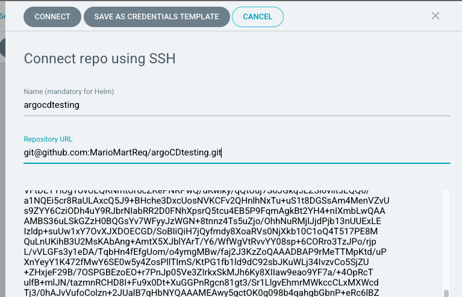
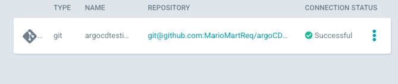

# From GIT to Kubernetes in 10 minutes with ArgoCD

_Instructions based from [this website.](https://santanderglobaltech.com/en/from-git-to-kubernetes-in-10-minutes-with-argocd/)_

## Pre-requisites

Before beginning the exercise, you will need:

- A Kubernetes cluster in you computer. See Docker Desktop or Minkube
- A Github account and GitHub CLI installed.

## 1. Install ArgoCD

As seen before, ArgoCD run as an operator and we have to deploy it in Kubernetes. Besides we need a new namespace Argocd where ArgoCD services will run.

- Create ArgoCD namespace:

```
$ kubectl create namespace argocd
```

- Install ArgoCD in Kubernetes:

```
$ kubectl apply -n argocd -f https://raw.githubusercontent.com/argoproj/argo-cd/stable/manifests/install.yaml
```

- Install also ArgoCD CLI in you computer: use [official manual.](https://argo-cd.readthedocs.io/en/stable/cli_installation/) (In Mac, it was as easy as doing `brew install argocd`)

### (Optional) Add SSH key from Argo to your GitHub account if using private repo

- Log into the argocd pod

```
$ kubectl -n argocd exec -it pod/argocd-server-xxxxx-xxxx bash
```

- Create a new SSH key:

```
$ ssh-keygen -t rsa
Generating public/private rsa key pair.
Enter file in which to save the key (/home/argocd/.ssh/id_rsa):
Created directory '/home/argocd/.ssh'.
Enter passphrase (empty for no passphrase):
Enter same passphrase again:
Your identification has been saved in /home/argocd/.ssh/id_rsa
Your public key has been saved in /home/argocd/.ssh/id_rsa.pub
The key fingerprint is:
...
```

- Copy the contents of `~/.ssh/id_rsa` file to your GitHub profile in Settings -> SSH and GPG keys -> New SSH key.

- In the argocd UI, add the new repo in Settings -> Repositories -> Connect repo using SSH.




## 2. Configure ArgoCD

Although the ArgoCD is already installed in our Kubernetes cluster, it cannot be accessed externally. In order to solve that, we will expose its API / UI server and configure the CLI to use it.

- Expose ArgoCD API Server:

```
$ kubectl patch svc argocd-server -n argocd -p '{"spec": {"type": "LoadBalancer"}}'
```

- Config ArgoCD CLI with username admin and password admin:

```
$ kubectl -n argocd patch secret argocd-secret -p '{"stringData": {"admin.password": "$2a$10$mivhwttXM0U5eBrZGtAG8.VSRL1l9cZNAmaSaqotIzXRBRwID1NT.", "admin.passwordMtime": "'$(date +%FT%T)'"}}'
$ argocd login localhost:10443 --username admin --password admin
```

- Expose ArgoCD UI:

```
kubectl port-forward svc/argocd-server -n argocd 10443:443 2>&1 > /dev/null &
```

- Finally, open ArgoCD UI in your browser: [https://localhost:10443](https://localhost:10443).

## 3. Create a deployment GIT repository

As we have seen before ArgoCD use a GIT repository as the source of truth. Therefore a repository must be created with the Kubernetes application configuration in one of its compatible ways. In our case, we are going to use a simple K8s yaml file.

- Create a repo in your Github account (Do it from the website if you don't have the github cli tools)

```
$ gh repo create --public argocdtesting -y && cd argocdtesting
```

- Add Readme.md and push to Github.

```
$ echo "From GIT to Kubernetes in 10 minutes with ArgoCD." > Readme.md
$ git add Readme.md
$ git commit -m "Added Readme.md" && git push --set-upstream origin master
```

- Create live branch and push to Github with no kubernetes resources.

```
$ git branch live
$ git push --set-upstream origin live
Upload “Guestbook” deployment file and commit changes to Github:
$ git checkout master
$ curl -kSs https://raw.githubusercontent.com/kubernetes/examples/master/guestbook/all-in-one/guestbook-all-in-one.yaml -o guestbook_app.yaml
```

I divided the contents of the `guestbook_app.yaml` into different files to make it more readable and store them in the `k8s` folder.

```
$ git add guestbook_app.yaml
$ git commit -m "Added guestbook_app.yaml"
$ git push --set-upstream origin master
```

## 4. Deploy using ArgoCD – 3 min

After the repo is ready, we must create an ArgoCD app using its own custom kubernetes resource. Furthermore, we are going to create a new namespace to deploy on it.

- Obtain HTTPS url of the GIT repository:

```
$ HTTPS_REPO_URL=$(git remote show origin | sed -nr 's/.+Fetch URL: (.+)/\1/p')
```

- Create k8s namespace:

```
kubectl create ns argocdtesting
```

Deploy App:

```
$ cat <<EOF | kubectl apply -f -
apiVersion: argoproj.io/v1alpha1
kind: Application
metadata:
  name: argocdtesting
  namespace: argocd
spec:
  destination:
    namespace: argocdtesting
    server: https://kubernetes.default.svc
  project: default
  source:
    repoURL: $HTTPS_REPO_URL
    path: ./k8s
    targetRevision: master
EOF
```

- Although the app is created, it has not been “deployed”. So we have to synchronize the app manually:

```
$ argocd app sync argocdtesting
```

- Check app status using Arcgocd CLI:

```
$argocd app get argocdtesting
```

- Check Kubernetes resources using kubectl:

```
$ kubectl -n argocdtesting get all
```

- Run the following command to forward port 18080 on your local machine to port 80 on the service.

```
$ kubectl port-forward -n argocdtesting svc/frontend 18080:80
```

Finally again, test [http://localhost:18080](http://localhost:18080) in your browser to view Guestbook app.

## 5. Deploy again but in auto mode

In the last 2 minutes, we are going to see how ArgosCD automatically syncs apps based in GIT commits as if we were working in multiple environments. The idea is to:

- Simulate a live environment.
- Deploy the app with the live branch created using a branch with no resources.
- Update the branch with the latest commit that add the yaml file.
- Wait until ArgoCD updates the app automatically.

So, let´s go:

- Create a new namespace for live environment:

```
kubectl create ns argocdtesting-live
```

- Deploy a new app in auto mode and listening to the live branch:

```
cat <<EOF | kubectl apply -f -
apiVersion: argoproj.io/v1alpha1
kind: Application
metadata:
  name: argocdtesting-live
  namespace: argocd
spec:
  destination:
    namespace: argocdtesting-live
    server: https://kubernetes.default.svc
  project: default
  source:
    repoURL: $HTTPS_REPO_URL
    path: ./k8s
    targetRevision: live
  syncPolicy:
    automated: {}
EOF
```

Now, we can see the app but with no resources.

- Sync live branch:

```
$ git checkout live
$ git merge master
$ git push –set-upstream origin live
```

- Go to ArgoCD UI and wait until changes have been applied:
  YES, we did it!
  After few simple steps, we have been able to deploy an app in 2 environments in 10 minutes. That was awesome!

Besides we’ve learned a lot of things:

- How to use GIT always as the source of truth of your deployments.
  GitOps is easier with ArgoCD.
- How to deploy automatically to multiple environments using different GIT branches.
  Thank you and see you in the next challenge
